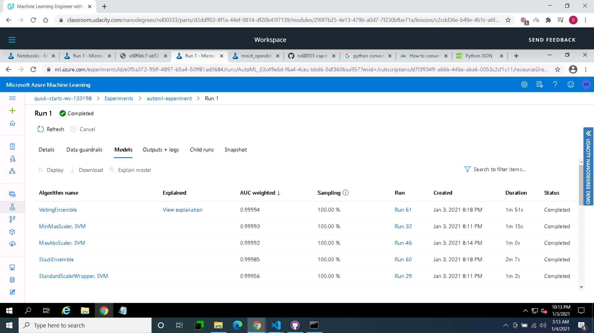
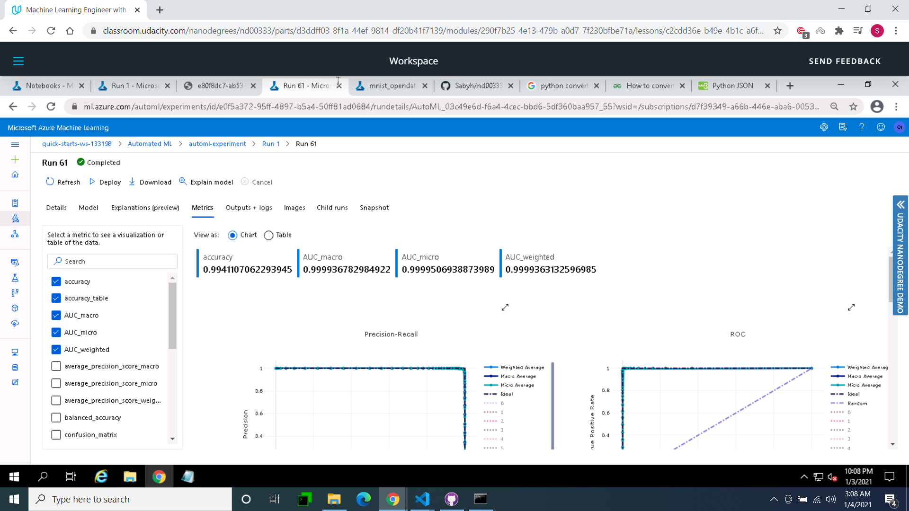
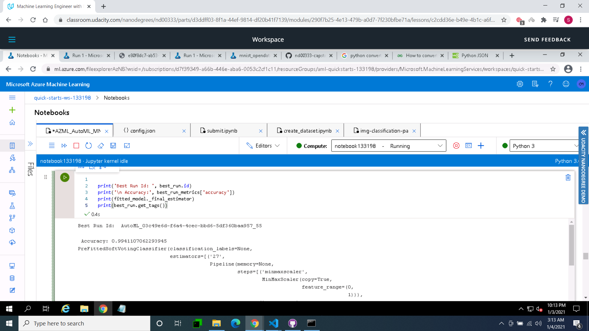

# MNIST Handwritten Digit Classification using Microsoft Azure

In this capstone project I have took MNIST and iris open source dataset from kaggle and trains it with 2 distinct methods. 
First utilizing AutoML and afterward utilizing HyperDrive with tuned hyperparameters. The best model will later be conveyed and tried.

## Dataset

### Overview
The data is taken from Kaggle repository. 

**Citation:** The data files contain gray-scale images of hand-drawn digits, from zero through nine.

Each image is 28 pixels in height and 28 pixels in width, for a total of 784 pixels in total. Each pixel has a single pixel-value associated with it, indicating the lightness or darkness of that pixel, with higher numbers meaning darker. This pixel-value is an integer between 0 and 255, inclusive.

The training data set, (train.csv), has 785 columns. The first column, called "digit", is the digit that was drawn by the user. The rest of the columns contain the pixel-values of the associated image.

Each pixel column in the training set has a name like pixelx, where x is an integer between 0 and 783, inclusive. To locate this pixel on the image, suppose that we have decomposed x as x = i * 28 + j, where i and j are integers between 0 and 27, inclusive. Then pixelx is located on row i and column j of a 28 x 28 matrix, (indexing by zero).

### Task

In this project, Azure AutoML and Hyperdrive will be used to make prediction on MNIST dataset. We will pass our model the image pixels in columns and our model will predict which digit the image pixel represent.

**Clinical features:**

The features are basically pixel values.


### Access
After downloading the MNIST Dataset from kaggle as a csv file, it is registered as a Dataset in the Azure Workspace in a Tabular form uploading from local system. 
I have used **Dataset.get_by_name(ws, dataset_name)** to access our registered dataset.

## Automated ML
The AutoML settings and configuration used are as follows:
```
from azureml.train.automl import AutoMLConfig
import time
import logging

automl_settings = {
    "name": "AutoML_Demo_Experiment_{0}".format(time.time()),
    "experiment_timeout_minutes" : 20,
    "enable_early_stopping" : True,
    "iteration_timeout_minutes": 10,
    "n_cross_validations": 5,
    "primary_metric": 'AUC_weighted',
    "max_concurrent_iterations": 10,
     "primary_metric" : 'accuracy'
}

automl_config = AutoMLConfig(task='classification',
                             debug_log='automl_errors.log',
                             path=project_folder,
                             compute_target=compute_target,
                             training_data=training_data,
                             label_column_name=label,
                             featurization= 'auto',
                             **automl_settings,
                             )
```
Experiment timeout is set to control the use of resources. Maximum 10 iterations can be run simultaneously to maximize usage. Classification task is performed as the target column digit has values 0-9. Primary metric was Accuracy to test how well our model performed in automl. Featurization is likewise done which naturally scales and standardizes the dataset.




### Results
The best performing model after training using AutoML is VotingEnsemble with the Accuracy of 0.994110 accuracy.

The other models that are used with VotingEnsemble and there weights are:
```
'ensembled_algorithms': "['MinMaxScalar SVM', 'MaxAbsScaler SVM', 'stackEnsemble',  'StandardScalarWrapper']"

'ensemble_weights': '[0.99993, 0.99992, 0.99985, 0.99956]'
```

To improve the model we can utilize distinctive objective measurement like AUC_weighted or Recall. We can likewise have a go at hypertuning the boundaries to check whether there is any improvement.




**Best Run Id**



**Best AutoML Model Registered**


## Hyperparameter Tuning
As it is a binary classification problem, the model used for HyperDrive is Logistic Regression. 
- It is easy to understand
- Trains very easily and faster compared to complex models


The parameters used for hyperparameter tuning are:
- Regularization Strength (C) with range 0.1 to 1.0
    -- Inverse of regularization strength. Smaller values cause stronger regularization
- Max Iterations (max_iter) with values 50, 100, 150 and 200
    -- Maximum number of iterations to converge


### Results
The best Accuracy for the HyperDrive model is 7666666666666667 %
The best hyperparameters for this accuracy are:
- 'Regularization Strength:': 0.5077980350098886
- 'Max iterations:': 50

To improve the model we can use different target metric to get broader perspective. We can also try increasing the range of the hyperparameters to see if there is any improvement.


**Best HyperDrive Model Registered**


## Model Deployment
The AutoMl model is deployed using Azure Container Instance as a WebService. Best run environment and score.py file is provided to the InferenceConfig.
Cpu_cores and memory_gb are initialized as 1 for the deployment configuration. The aci service is then created using workspace, aci service name, model, inference config and deployment configuration.

The model is successfully deployed as a web service and a REST endpoint is created with status Healthy. A scoring uri is also generated to test the endpoint.


The endpoint is tested in 2 ways: 
- using endpoint.py file which passes 2 data points as json 
- using 3 random sample data points and to see the actual value and predicted value 


## Screen Recording
Link to screencast: [Link](https://youtu.be/fj7Av9YiuiY)

## Future Improvements
- Larger dataset can be used to increase data quality
- Different models can also be used with hyperparameter tuning
- Feature engineering can be performed using PCA 
